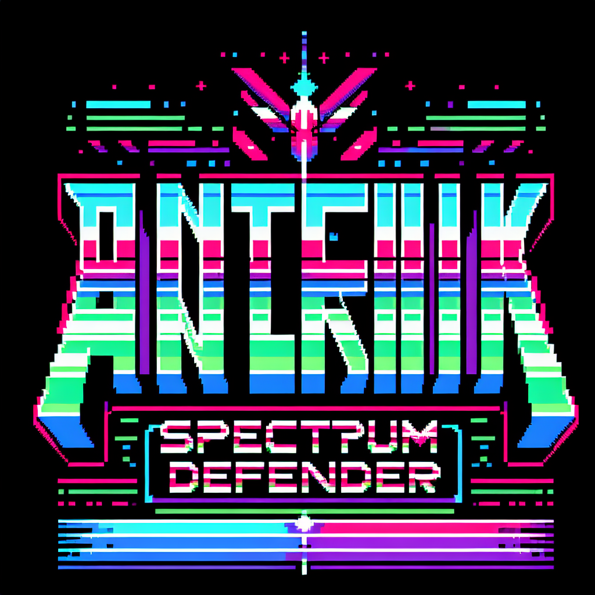

# Anterix Launch: Spectrum Defender

A retro arcade game celebrating Anterix's critical telecommunications infrastructure, combining classic Asteroids and Space Invaders gameplay.

**[Play Now](https://anterix-asteroids.vercel.app)** | [GitHub](https://github.com/dbbuilder/anterix-asteroids)



## 🎮 Play the Game

**Live Demo:** https://anterix-asteroids.vercel.app

Or open `index.html` locally in a modern web browser. No installation required!

## 🕹️ Controls

| Key | Action |
|-----|--------|
| ← / A | Rotate Left |
| → / D | Rotate Right |
| ↑ / W | Thrust Forward |
| SPACE | Fire Spectrum Beam |
| B | Deploy Network Surge (Bomb) |
| P | Pause Game |
| M | Toggle Music |
| ENTER | Start Game / Restart |

## 🎯 Enemies

| Enemy | Points | Description |
|-------|--------|-------------|
| Signal Disruptor | 100 | Fast-moving basic enemy |
| Data Packet | 250 | Tiny, very fast bonus target |
| Network Node | 150 | Splits into smaller nodes |
| Legacy Tower | 200 | Large, slow asteroid |
| Spectrum Jammer | 1000 | Boss enemy (every 5 waves) |

## ⚡ Power-Ups

- **🔵 Bandwidth Boost** - Increased fire rate (10 seconds)
- **🟢 Signal Shield** - Invincibility (5 seconds)
- **🟡 Spectrum Spread** - Triple shot (15 seconds)
- **🔴 Network Surge** - Adds one screen-clearing bomb

## 🏆 Scoring

- Base points per enemy destroyed
- Combo multiplier: Kills within 2 seconds increase multiplier (max 8x)
- Wave completion bonus: 500 × wave number
- Perfect wave (no damage): 2x wave bonus

## 📁 Project Structure

```
anterix-asteroids/
├── index.html              # Complete game (single file)
├── REQUIREMENTS.md         # Project requirements
├── README.md               # This file
├── TODO.md                 # Development tasks
├── FUTURE.md               # Future enhancements
├── .gitignore              # Git ignore file
├── scripts/
│   ├── generate_sprites.py # DALL-E sprite generator
│   └── requirements.txt    # Python dependencies
└── sprites/
    ├── README.md           # Sprite documentation
    └── *.png               # Generated sprite images
```

## 🎨 Sprite Generation (Optional)

The game uses Canvas-drawn vector graphics by default. For enhanced visuals, you can generate pixel art sprites using DALL-E:

```bash
# Install Python dependencies
cd scripts
pip install -r requirements.txt

# Set your OpenAI API key
set OPENAI_API_KEY=your-api-key-here

# Generate sprites
python generate_sprites.py
```

## 🖥️ Browser Support

- Chrome 90+
- Firefox 88+
- Safari 14+
- Edge 90+

## 🛠️ Development

```bash
# Clone repository
git clone https://github.com/dbbuilder/anterix-asteroids.git
cd anterix-asteroids

# Open in browser (no build step required)
start index.html
```

## 📜 License

Corporate internal use - Anterix Launch Event

## 🏢 About Anterix

Anterix is focused on securing the foundation for the modernization of critical infrastructure in the United States, primarily through our spectrum holdings in the 900 MHz band.
